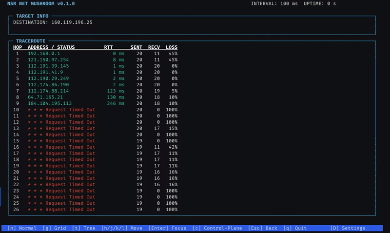

## NSR (Net muShRoom) 🍄

<p align="center">
  
  <br>
  <em>"Wait, is that actually tobacco? I can smell 'Purple haze' from his Gat..."</em>
</p>

> **N**ot **S**ome **R**ust
> 
> **N**aughty **S**afety **R**uff
> 
> **N**etwork **Sniffer** t**R**aC3R



NSR is a high-performance, **architecturally resilient** C23 implementation of a multi-target network tracer built on custom systems library. Rather than treating raw throughput as the only metric that matters, NSR explores how far a tracer can push process isolation, deterministic execution, and low binary overhead without collapsing real-world performance.

---

## 🚀 Usage Guide

### Build Requirements
- GCC 13+
- `ncursesw`
- `libpthread`
- Linux raw socket capability (`sudo` required for ICMP mode)

```bash
cd nsr
git submodule init
git submodule update --recursive
make
sudo ./nsr <target_ip>
````

### Example

```bash
sudo ./nsr 8.8.8.8
sudo ./nsr 2606:4700:4700::1111
```

---

## TUI Controls

* `Q` → Quit
* `S` → Toggle statistics overlay
* `P` → Pause / Resume tracing
* `N` → Normal mode
* `G` → Grid mode
* `T` → Tree mode
* `H/J/K/L` → Move cursor
* `Enter` → Focus node
* `C` → Toggle control-plane node
* `Esc` → Back to previous view
* `↑ / ↓` → Scroll hop list

---

## Telemetry Architecture

Unlike conventional single-process tracers such as Trippy, NSR intentionally separates responsibilities across isolated execution domains.

```text
Logic Engine
    ↓
IPC Boundary
    ↓
Gatekeeper
    ↓
Raw Socket I/O
    ↓
Observation Processing
    ↓
TUI
```

### Logic Engine

Responsible for:

* TTL scheduling
* probe sequencing
* routing logic
* deterministic state progression

This layer does not directly interact with raw sockets.

---

### Gatekeeper

Responsible for:

* raw socket ownership
* ICMP packet transmission
* ICMP response capture
* network boundary containment

All external packet interaction happens here.

---

### State Layer

NSR uses structured state management for:

* hop tracking
* RTT updates
* sequence correlation
* recovery-oriented state continuity

---

## Isolation Model

NSR prioritizes fault containment over architectural simplicity.

### Syscall Minimization

Core logic avoids direct ownership of network-facing operations.

### Process Separation

Failures in packet I/O are isolated from tracing logic and UI rendering.

### Deterministic Execution

Predictable execution cycles reduce timing volatility.

### Crash Containment

Failures remain localized instead of collapsing the entire tracer process.

---

# 📊 Verified Benchmark Results

Measured against a real internet target (`8.8.8.8`) with both tracers constrained to exactly the same physical transmission limits (10 ms minimum interval, as dictated by Trippy's constraints) over a ~10-second period. Both tools successfully transmitted and received real observations (`recv > 0`).

### End-to-End Throughput Comparison (10 ms Interval Limit)

| Metric                | Trippy (Rust, Release) | NSR (C, `-Ofast`)    |
| :-------------------- | :--------------------- | :------------------- |
| **Duration**          | ~10.0 s                | ~9.98 s              |
| **Probes Sent**       | 1,001                  | **3,695**            |
| **Observations Recv** | 5                      | **15**               |
| **Throughput**        | ~100 probes/sec        | **~370 probes/sec**  |
| **Binary Size**       | 9.2 MB                 | **63 KB**            |
| **Max RSS**           | **7.8 MB**             | ~33.9 MB             |

> **Note on Throughput:** Both tools were artificially clamped to a `10ms` minimum round duration. NSR's batch-emitting logic and lighter per-probe overhead allow it to push **~3.7× the throughput** of Trippy within the exact same time constraints, while the binary remains **~150× smaller**.

### Measured NSR Output (Optimized 10 ms pacing)

```text
--- NSR E2E BENCHMARK RESULT ---
Probes Sent: 3695
Observations Recv: 15
Elapsed Time: 9.98 s
Throughput: 370.12 probes/s
```

---

## Internal Primitive Benchmark

```bash
make nsr_bench
./nsr_bench
```

Result:

```text
--- NSR MICRO-BENCHMARK ---
Fast Integrity speed: 0.44 ns/op (Total: 4 ms for 10M ops)
nsr_telemetry_state_t size: 15936 bytes
nsr_intent_t size: 24 bytes
nsr_observation_t size: 40 bytes
```

This benchmark measures internal computation primitives only.

It is **not** used as a throughput claim for the full tracer pipeline.

---

## Why NSR Is Small

### Aggressive Native Compilation

* LTO
* `-Ofast`
* section garbage collection
* stripped binary output

### Minimal Runtime Dependencies

No large async runtime layer.

### Explicit Resource Ownership

Memory behavior remains predictable.

---

## Tradeoffs

NSR intentionally accepts additional architectural complexity in exchange for stronger isolation.

Compared to conventional tracers:

### NSR gains
- smaller binaries
- stronger fault boundaries
- process isolation
- recovery experimentation
- multi-node topology observability

### NSR loses
- simpler architecture
- easier maintenance
- ecosystem maturity

---

## Conclusion

NSR demonstrates that C can still produce modern network tooling that is:

- extremely small
- operationally fast
- fault-isolated
- structurally explicit

while remaining competitive with significantly heavier tracer implementations.
